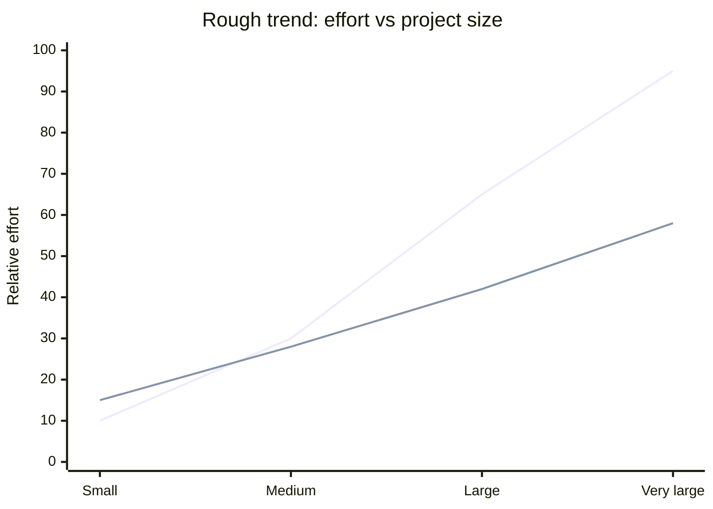

# From Procedural to OOP

Until now, most of your programs have been **procedural**: data lives in variables, and behavior lives in free functions that take that data as arguments.

That works. It is how a huge amount of real software is still written. But as programs grow, keeping state and behavior separate gets harder to reason about.

## State and behavior, apart

So far you have:

- **Variables** for state (what something *is* right now)
- **Functions** for behavior (what you can *do* with that state)

They are related, but they live in different places.

```
fillTank(car);
```

The function knows how to fill a tank. The `car` variable holds the fuel level. Nothing in the type system ties them together. Any function could reach for any car's data if you pass the wrong thing.

## OOP: data and behavior together

**Object-oriented programming (OOP)** groups state and the operations on that state into one unit: an **object**.

```
car.fillTank();
```

Same idea, different shape: `car` carries its own state, and `fillTank` is an operation *on* that car. The `noun.verb()` style is everywhere in OOP (and in many libraries). It is not required for OOP, but it matches how people think: "tell this object to do something."

> NOTE: Everything you will do with OOP can be done without it. OOP is a tool for organizing large programs, not a language requirement. It often adds a small abstraction cost, and heavily object-oriented code can run slightly slower than hand-tuned procedural code. Going from 100 ns to 120 ns per call usually does not matter if the program is easier to build and maintain.

## Procedural vs object-oriented: counting legs

Look at one animal: a dog with four legs.

**Procedural:** the name and leg count are separate variables. A free function does the work.

```cpp
#include <iostream>
#include <string>

void printLegs(const std::string& name, int legs)
{
    std::cout << name << " has " << legs << " legs\n";
}

int main()
{
    std::string name{"Dog"};
    int legs{4};

    printLegs(name, legs);

    return 0;
}
```

**Object-oriented (using a `struct` for simplicity):** the data and a small behavior live together.

```cpp
#include <iostream>
#include <string>

struct Animal
{
    std::string name;
    int legs;

    void printLegs() const
    {
        std::cout << name << " has " << legs << " legs\n";
    }
};

int main()
{
    Animal dog{"Dog", 4};

    dog.printLegs();

    return 0;
}
```

Both print `Dog has 4 legs`. What changed?

| Procedural | Object-oriented |
|------------|-----------------|
| `name` and `legs` are separate variables | `Animal` groups related data |
| `printLegs(name, legs)` passes state into a free function | `dog.printLegs()` uses data already on the object |
| Easy to call `printLegs` with mismatched name and count | Name and legs stay bundled on `dog` |

The OOP version is not magic yet. It is one step toward **localizing** knowledge: behavior can live on the type instead of in unrelated functions that take loose parameters.

## The software crisis and why OOP caught on

> HISTORY: From the 1960s through the 1980s, many teams saw software effort grow much faster than program size. Larger systems meant more coordination, more time reading unfamiliar code, and more bugs from interactions between previously independent parts. Development cost often scaled worse than linearly with lines of code. Hardware was improving quickly, but on machines tiny compared to today, the bottleneck was often organization, not raw CPU speed.

OOP was promoted as a way to bend that cost curve. You pay a bit more upfront (designing types, boundaries, interfaces). In return, coupling drops, reuse goes up, and changes stay local. For small homework programs the overhead is not worth it. For a second-course project with many cooperating pieces, objects often pay for themselves.



🟥 Procedural style (first line)  
🟦 OOP style (second line)

The crossover is not exact science. The point is qualitative: OOP trades a higher starting cost for slower growth as complexity increases. For many students, the lines cross around a **second programming course** sized project.

## What counts as an object?

An **object** is a concrete instance that combines:

- **Properties** (data it knows about itself)
- **Behavior** (things it can do with that data)

A `struct` can already do both, as the animal example showed. You have mostly used structs as **bags of variables**. Next sections add behavior on purpose, then introduce **`class`** when you need stronger boundaries around that data.
