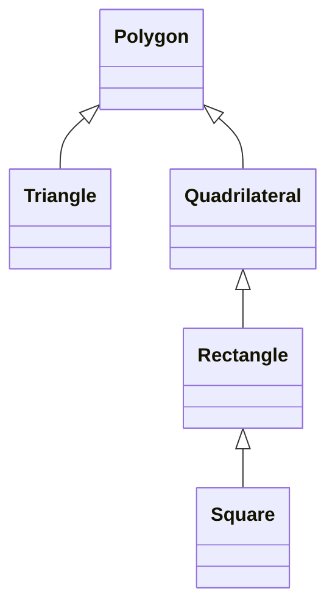

# Introduction to Inheritance

You know how to build a **class**: private data, a constructor, and member functions. Sometimes the next type is **almost the same** as one you already have, with a little extra behavior or data.

**Inheritance** lets a new class **reuse** an existing class and **add** on top. The new type gets the base class members and methods, plus anything you define for itself.

## Shapes: a familiar hierarchy

Imagine types for flat shapes:



A **`Triangle`** can reuse everything **`Polygon`** already defines (side count, perimeter helpers, whatever you put in the base) and add triangle-specific pieces (three vertices, height, and so on).

Same story for **`Rectangle`** and **`Square`**: a square *is* a rectangle with equal sides, so it can inherit width/height logic and tighten the rules.

## Rectangle and Square

```cpp
#include <iostream>

class Rectangle
{
protected:
    double w{};
    double h{};

public:
    Rectangle(double width, double height)
        : w{width}
        , h{height}
    {
    }

    double area() const
    {
        return w * h;
    }
};

class Square : public Rectangle
{
public:
    Square(double side)
        : Rectangle{side, side}
    {
    }
};

int main()
{
    Square tile{4.0};
    std::cout << tile.area() << '\n';
    return 0;
}
```

| Piece | Role |
|-------|------|
| **`Rectangle`** | Base class: width, height, `area()` |
| **`Square : public Rectangle`** | Derived class: one `side` passed to `Rectangle{side, side}` |
| **`protected`** | Derived classes can see `w` and `h`; outsiders still cannot |

`Square` does not reimplement `area()`. It inherits the rectangle version, which works because a square stored as equal width and height is correct.

> NOTE: Some inheritance is good. Too many layers get hard to read and hard to change. Add a base class when it **helps**, not because the problem *could* be forced into inheritance.

## Try it now

### Exercise 1: Read the hierarchy

Prompt: In the diagram above, name the **base** class and one **derived** class. Which class sits between `Quadrilateral` and `Square`?

:::details Answer

**Base:** `Polygon` (root of the tree). **Derived:** any class with an arrow pointing to its parent (for example `Triangle` derives from `Polygon`). **Between `Quadrilateral` and `Square`:** `Rectangle`.

:::
