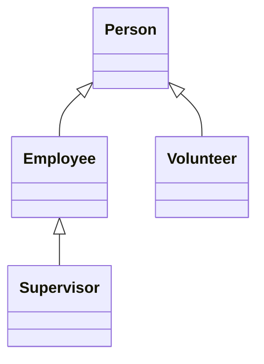

# Base and Derived Classes

Inheritance vocabulary shows up under several names. They mean the same relationships:

| Term | Meaning |
|------|---------|
| **Base** / **parent** / **superclass** | The class you inherit **from** |
| **Derived** / **child** / **subclass** | The class that inherits |

Syntax:

```
class Derived : public Base
{
};
```

Read that as: **`Derived`** gets **`Base`**'s members (subject to access rules) and may add its own.

## One chain, many branches

A derived class can become a **base** for another class. One base can have **many** derived classes.



- **`Employee`** and **`Volunteer`** both extend **`Person`**
- **`Supervisor`** extends **`Employee`**, not `Person` directly (though it still *is* a person through the chain)

## A simple Person

```cpp
#include <iostream>
#include <string>

class Person
{
protected:
    std::string name;
    int age{};

public:
    Person(std::string personName, int personAge)
        : name{std::move(personName)}
        , age{personAge}
    {
    }

    void print() const
    {
        std::cout << name << ", age " << age << '\n';
    }
};

int main()
{
    Person ada{"Ada", 30};
    ada.print();
    return 0;
}
```

This is the **base** for the examples in the next section. `protected` lets derived classes reach `name` and `age` without making them public.

> NOTE: **`private`** base members are **not** visible in derived classes. You either expose what children need with **`protected`**, or add getters on the base.

## Try it now

### Exercise 1: Name the relationship

Prompt: If `class Dog : public Animal`, which is the base class and which is derived?

:::details Answer

**Base:** `Animal`. **Derived:** `Dog`.

:::
