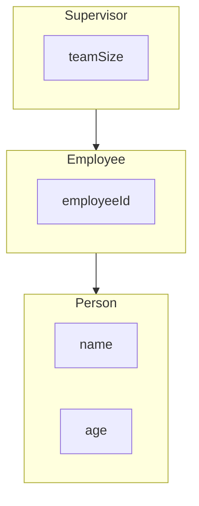

# Constructing Derived Objects

Creating a derived object **builds the base first**, then the derived part. You must construct from the **bottom layer up**.

## Layer cake of data members



Each constructor's job:

1. Call the **immediate parent** constructor in the initializer list
2. Initialize **this class's** members

You do **not** list grandparent members in the initializer list. **`Supervisor`** calls **`Employee{...}`**; **`Employee`** calls **`Person{...}`**.

## Explicit parent call

```cpp
#include <iostream>
#include <string>

class Person
{
protected:
    std::string name;
    int age{};

public:
    Person(std::string personName, int personAge)
        : name{std::move(personName)}
        , age{personAge}
    {
        std::cout << "Person constructed\n";
    }
};

class Employee : public Person
{
private:
    int employeeId{};

public:
    Employee(std::string personName, int personAge, int id)
        : Person{personName, personAge}
        , employeeId{id}
    {
        std::cout << "Employee constructed\n";
    }
};

int main()
{
    Employee dev{"Lin", 28, 101};
    return 0;
}
```

Output:

```
Person constructed
Employee constructed
```

If you omit **`Person{...}`** and `Person` has no default constructor, the program **does not compile**. If `Person` *does* have a default constructor, the compiler calls that implicitly (often not what you want).

## Default parent constructor

When the base has a default constructor and you say nothing, C++ calls it for you:

```cpp
class Person
{
public:
    Person() = default;
    Person(std::string n, int a) { /* ... */ }
};

class Employee : public Person
{
public:
    Employee(int id)
        : employeeId{id}  // implicitly calls Person{}
    {
    }
};
```

> NOTE: You **cannot** initialize a base class member directly in a derived initializer list (`name{...}` on `Employee` is wrong). Call a **base constructor** instead.

## Try it now

### Exercise 1: Constructor order

Prompt: Using the first example in this section (`Person` then `Employee` messages), which line prints first when you create an `Employee`?

:::details Answer

**`Person constructed`** prints first. Base before derived.

:::
