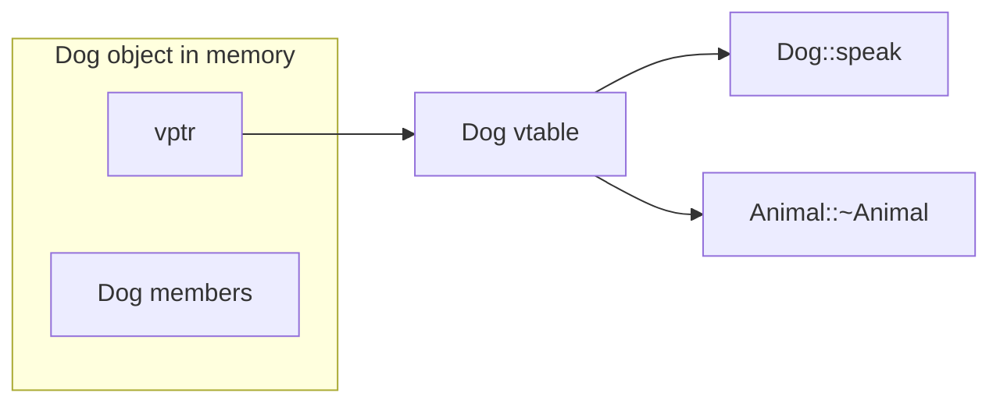

# Virtual Functions

[Object Slicing and Polymorphism](06object%20slicing%20and%20polymorphism.md) showed that copying into a base object **slices** derived data away. A **pointer** keeps the full object in memory, but the compiler still picks a member function from the **static type** of the expression unless you mark the base function **`virtual`**.

## Same object, different static types

A **`Dog`** object is always a full **`Dog`** in memory. What changes is how C++ **types** the expression you use to reach it:

| Expression | Static type | Calls `speak()` on... (no `virtual`) |
|------------|-------------|--------------------------------------|
| `Dog d;` `d.speak()` | `Dog` | `Dog` |
| `Dog& r = d;` `r.speak()` | `Dog` | `Dog` |
| `Dog* p = &d;` `p->speak()` | `Dog` | `Dog` |
| `Animal& r = d;` `r.speak()` | `Animal` | **`Animal`** |
| `Animal* p = &d;` `p->speak()` | `Animal` | **`Animal`** |

When the **static type** is the base class (`Animal&` or `Animal*`), the compiler picks the **base** member function unless you mark it **`virtual`**.

Run this program and read the output:

```cpp
#include <iostream>

class Animal
{
public:
    void speak() const
    {
        std::cout << "Animal sound\n";
    }
};

class Dog : public Animal
{
public:
    void speak() const
    {
        std::cout << "Woof!\n";
    }
};

int main()
{
    Dog dog{};

    dog.speak();                         // Dog
    static_cast<Animal&>(dog).speak();   // Animal (same object, base reference)

    Animal* ptr = &dog;
    ptr->speak();                        // Animal (pointer static type is Animal*)

    return 0;
}
```

The **`Dog`** is still in memory. The calls through **`Animal&`** and **`Animal*`** use the base function because **`speak`** is not **`virtual`**.

## The zoo: one list, many animals

You want a **`std::vector`** of different animals and a loop that makes each one act like itself:

```cpp
for (Animal* pet : zoo)
{
    pet->speak();   // want Woof for dogs, Meow for cats
}
```

Without **`virtual`**, every call prints the **`Animal`** version. With **`virtual`** on the base and overrides on derived classes, the **object** picks the function at **run time**.

```cpp
#include <iostream>
#include <vector>

class Animal
{
public:
    virtual void speak() const
    {
        std::cout << "...\n";
    }

    virtual ~Animal() = default;
};

class Dog : public Animal
{
public:
    void speak() const override
    {
        std::cout << "Woof!\n";
    }
};

class Cat : public Animal
{
public:
    void speak() const override
    {
        std::cout << "Meow!\n";
    }
};

int main()
{
    Dog dog{};
    Cat cat{};

    std::vector<Animal*> zoo{};
    zoo.push_back(&dog);
    zoo.push_back(&cat);

    for (Animal* pet : zoo)
    {
        pet->speak();
    }

    return 0;
}
```

Output:

```
Woof!
Meow!
```

> PREFERENCE: Put **`virtual`** on the base function. Put **`override`** on derived overrides so the compiler catches typos (you thought you overrode `speak()` but actually hid a different name).

## `virtual` only through pointers and references

**`virtual`** dispatch applies when you call through a **pointer** or **reference** whose static type is the base. It does **not** apply when you **copy** into a base **object**:

```cpp
Dog dog{};
Animal sliced = dog;   // slices: Animal object only
sliced.speak();        // Animal::speak, even if speak is virtual
```

## `final`: stop overriding

On a **terminal** class (nothing should inherit further), mark the override **`final`**:

```cpp
class Dog : public Animal
{
public:
    void speak() const override final
    {
        std::cout << "Woof!\n";
    }
};
```

You can also mark a base virtual function **`final`** to forbid any override in derived classes.

## Virtual destructors

Destruction runs [base first on the way in, derived first on the way out](05destruction%20order.md). If you **`delete`** through a **`Base*`**, the base destructor must be **`virtual`** so the **derived** destructor runs first and cleans up derived-only resources.

```cpp
Animal* pet = new Dog{};
delete pet;   // safe only if Animal::~Animal() is virtual
```

Without a virtual destructor, **`delete pet`** might run only **`Animal`'s** destructor and leak or leave derived state inconsistent.

> PREFERENCE: Follow the **rule of zero**: use RAII and smart pointers (`std::unique_ptr`, containers) so you rarely write **`delete`** yourself. When you do use runtime polymorphism with ownership, **`virtual ~Base() = default`** on the base is the usual habit.

## The vtable (conceptual)

How does **`ptr->speak()`** reach **`Dog::speak`** when **`ptr`** is **`Animal*`**?

Each polymorphic class gets a **virtual table** (**vtable**): a small list of function pointers for its virtual functions. Each object stores a hidden **vtable pointer** (**vptr**) to the right table for its **dynamic** (actual) type.



At the call site, the runtime follows **`vptr`** → **`vtable`** → **`Dog::speak`**. You do not manage the vtable yourself; **`virtual`** tells the compiler to generate this machinery.

## Try it now

### Exercise 1: Fix the zoo

Prompt: The loop should print **`Woof!`** then **`Meow!`**. Add whatever is missing on **`Animal::speak`** (one keyword).

```cpp
#include <iostream>
#include <vector>

class Animal
{
public:
    void speak() const
    {
        std::cout << "...\n";
    }

    virtual ~Animal() = default;
};

class Dog : public Animal
{
public:
    void speak() const override
    {
        std::cout << "Woof!\n";
    }
};

class Cat : public Animal
{
public:
    void speak() const override
    {
        std::cout << "Meow!\n";
    }
};

int main()
{
    Dog dog{};
    Cat cat{};
    std::vector<Animal*> zoo{&dog, &cat};

    for (Animal* pet : zoo)
    {
        pet->speak();
    }

    return 0;
}
```

:::details Hint

The derived functions are marked **`override`**, but the base function is not yet **`virtual`**. Calls through **`Animal*`** use the static type **`Animal`**.

:::

:::details Solution

**Reasoning:** Runtime dispatch requires a **`virtual`** function in the base. Change **`void speak() const`** to **`virtual void speak() const`**.

```cpp
virtual void speak() const
{
    std::cout << "...\n";
}
```

:::

### Exercise 2: Sliced virtual call

Prompt: `Dog d{};` `Animal sliced = d;` `sliced.speak();` If **`speak`** is **`virtual`**, does **`sliced`** print **`Woof!`**?

:::details Answer

**No.** **`sliced`** is an **`Animal`** object. The **`Dog`** part was copied away, so virtual dispatch uses **`Animal::speak`**.

:::
