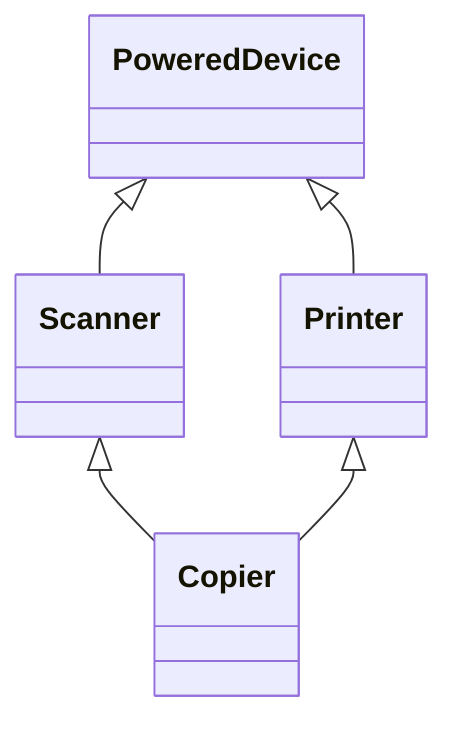

# Multiple Inheritance

C++ allows a class to inherit from **more than one** base:

```cpp
class Copier : public Scanner, public Printer
{
};
```

That sounds flexible. In practice it creates design problems fast.

## The diamond problem



If **`Scanner`** and **`Printer`** both inherit **`PoweredDevice`**, does **`Copier`** contain **one** or **two** copies of **`PoweredDevice`**?

Ambiguity breaks compilation or forces fragile **`virtual`** inheritance tricks. The cure is usually a simpler design, not a cleverer diamond.

## What to do instead

Patterns that avoid multiple inheritance:

- **One base class**, add other behavior with **members** (composition)
- **Interfaces** as separate abstract bases (advanced; still needs care)
- **Free functions** or **namespaces** for shared utilities

> PREFERENCE: Limit each class to **one direct parent** in this book. The wins from multiple inheritance are usually available through composition and clearer types.

> NOTE: Many languages skip multiple inheritance entirely. Designs that avoid it port more easily and read more clearly in code review.

## Try it now

### Exercise 1: One sentence

Prompt: Why does this book suggest one parent per class instead of `class Copier : Scanner, Printer`?

:::details Answer

Multiple inheritance creates ambiguity (the **diamond problem**) and tight coupling. **Composition** (`Copier` **has-a** scanner and printer) is easier to maintain.

:::
