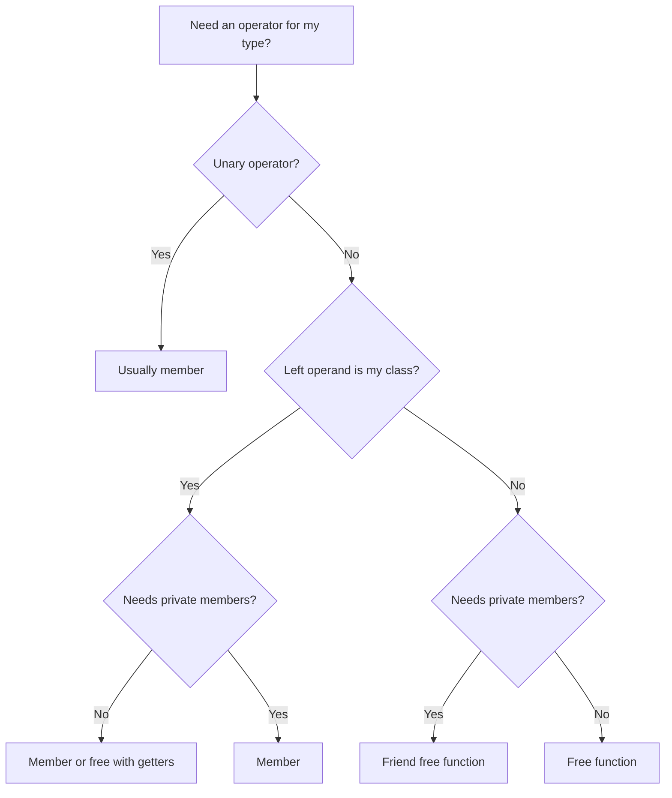

# Choosing Member, Friend, or Free

Use this decision order when you add an operator for your type.

## Quick reference

| Situation | Prefer |
|-----------|--------|
| Unary (`-x`, `++x`, `!x`) | **Member** |
| Binary, left operand is your class (`a + b`) | **Member** if natural |
| Need private fields, left is your class | **Member** |
| Need private fields, left is not your class (`cout << p`) | **Friend** |
| Public interface is enough | **Free** (no `friend`) |

## Decision flow



## Examples mapped to the table

| Operator | Typical form | Why |
|----------|--------------|-----|
| `fraction + fraction` | Member | Left is `Fraction`; uses private parts |
| `cout << point` | Friend or free | Left is `ostream` |
| `point == point` | Member or free | Often member; free is fine with public `x`, `y` |
| `-vector` | Member | Unary |

## Symmetry

For `a + b` and `b + a` when types differ, you may need **two** overloads or one **friend** that sees both types. Member `operator+` only handles “my type on the left.”

```cpp
class A {};
class B {};

A operator+(const A& left, const B& right);  // friend or free
B operator+(const B& left, const A& right);  // second overload if both orders matter
```

## Try it now

### Exercise 1: Negation

Prompt: `Vector2D` needs unary `-v`. Member, friend, or free?

:::details Answer

**Member.** Unary operators almost always use the object as the sole operand: `v.operator-()`.

:::

### Exercise 2: Stream output

Prompt: `std::cout << student` where `Student` has private `name`. Best approach?

:::details Answer

**Friend** `operator<<` (or a free function if you add a public `name()` getter).

:::
