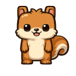

# Images and Textures

## Surface vs texture

| | **SDL_Surface** | **SDL_Texture** |
|---|-----------------|-----------------|
| Memory | CPU (RAM) | GPU-friendly (via renderer) |
| Draw with | Software blit, or convert first | **`SDL_RenderCopy`** |
| Typical load | `IMG_Load` → surface | `IMG_LoadTexture` → texture |

**SDL2_image** can load a file straight to a texture:

```cpp
SDL_Texture* tex = IMG_LoadTexture(renderer, "assets/dude.png");
```

Or load a surface and upload:

```cpp
SDL_Surface* surface = IMG_Load("assets/dude.png");
SDL_Texture* tex = SDL_CreateTextureFromSurface(renderer, surface);
SDL_FreeSurface(surface);
```

Use the **texture** each frame; free the surface after upload.

## `SDL_Rect` and `nullptr`

`SDL_Rect` holds **`x`**, **`y`**, **`w`**, **`h`**. For **`SDL_RenderCopy`**:

- **Source rect** — which part of the texture to use. Pass **`nullptr`** to mean **the whole texture**.
- **Dest rect** — where and how large to draw on screen.

```cpp
SDL_Rect dest{x, y, w, h};
SDL_RenderCopy(renderer, tex, nullptr, &dest);
```

## Sub-rectangles, scaling, rotation

**Crop** with a source rect (sprite sheet):

```cpp
SDL_Rect src{0, 0, 32, 32};
SDL_Rect dest{x, y, 64, 64};
SDL_RenderCopy(renderer, tex, &src, &dest);
```

**Scale** by making `dest.w` / `dest.h` different from the source size.

**Rotate** with **`SDL_RenderCopyEx`** (angle in degrees, center pivot):

```cpp
SDL_RenderCopyEx(renderer, tex, nullptr, &dest, angleDegrees, nullptr, SDL_FLIP_NONE);
```

## Load once, draw every frame

**Never** call `IMG_LoadTexture` inside the game loop. Load at startup, draw each frame.

```sdl2
// @asset: assets/dude.png
#include <SDL2/SDL.h>
#include <SDL2/SDL_image.h>

int main(int, char**)
{
    SDL_Init(SDL_INIT_VIDEO);
    IMG_Init(IMG_INIT_PNG);

    SDL_Window* window = SDL_CreateWindow(
        "Texture",
        SDL_WINDOWPOS_CENTERED,
        SDL_WINDOWPOS_CENTERED,
        640,
        480,
        SDL_WINDOW_SHOWN);

    SDL_Renderer* renderer = SDL_CreateRenderer(window, -1, SDL_RENDERER_ACCELERATED);

    SDL_Texture* player = IMG_LoadTexture(renderer, "assets/dude.png");
    if (player == nullptr)
    {
        SDL_Log("IMG_LoadTexture: %s", IMG_GetError());
        return 1;
    }

    int texW{0};
    int texH{0};
    SDL_QueryTexture(player, nullptr, nullptr, &texW, &texH);

    float x{280.0f};
    float y{200.0f};
    double angle{0.0};

    bool running{true};
    SDL_Event event{};

    while (running)
    {
        while (SDL_PollEvent(&event))
        {
            if (event.type == SDL_QUIT)
            {
                running = false;
            }
            if (event.type == SDL_KEYDOWN)
            {
                if (event.key.keysym.sym == SDLK_LEFT)
                {
                    x -= 10.0f;
                }
                if (event.key.keysym.sym == SDLK_RIGHT)
                {
                    x += 10.0f;
                }
            }
        }

        angle += 1.5;

        SDL_SetRenderDrawColor(renderer, 40, 44, 52, 255);
        SDL_RenderClear(renderer);

        SDL_Rect dest{
            static_cast<int>(x),
            static_cast<int>(y),
            texW,
            texH};
        SDL_RenderCopyEx(renderer, player, nullptr, &dest, angle, nullptr, SDL_FLIP_NONE);

        SDL_RenderPresent(renderer);
        SDL_Delay(16);
    }

    return 0;
}
```

Arrow keys move the sprite; it **rotates** every frame so motion is obvious. **`nullptr`** source = full `dude.png`.



Docs: [SDL_RenderCopy](https://wiki.libsdl.org/SDL2/SDL_RenderCopy), [SDL_RenderCopyEx](https://wiki.libsdl.org/SDL2/SDL_RenderCopyEx).

## Try it now

### Exercise 1: Where to load

Prompt: Should `IMG_LoadTexture` run inside or outside the `while (running)` loop?

:::details Answer

**Outside** (once at startup).

:::

### Exercise 2: Full texture

Prompt: In `SDL_RenderCopy(renderer, tex, nullptr, &dest)`, what does `nullptr` mean for the source?

:::details Answer

Use the **entire texture** as the source rectangle.

:::
